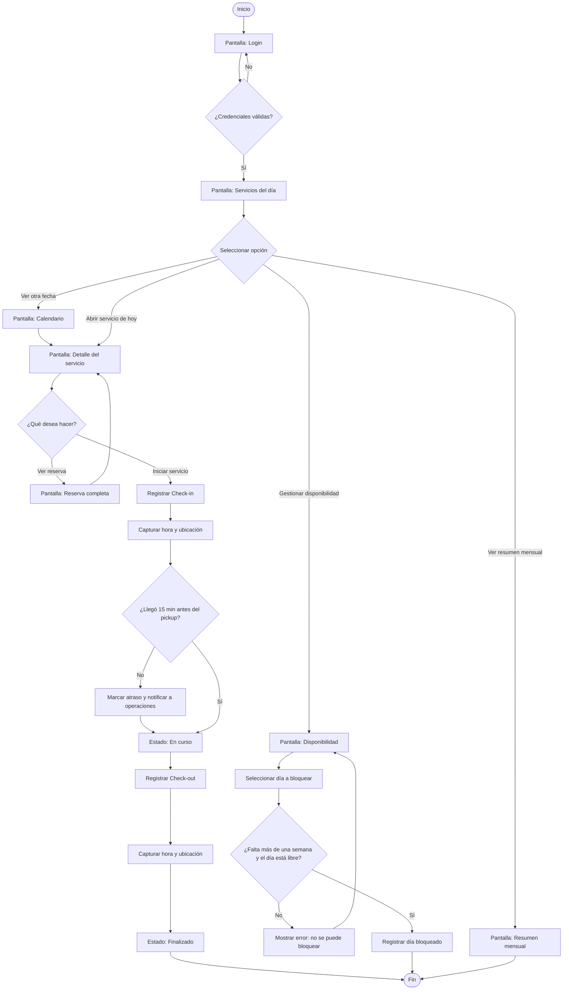

# Proyecto Lince — SouthTour

**Propósito:** Aplicación móvil Android para los guías y transportistas de Southbound. Permite consultar los servicios que el equipo de operaciones ya les asignó, revisar su detalle y los requisitos de cada agencia, gestionar su disponibilidad y registrar check-in y check-out en terreno con hora y ubicación.

La aplicación **no asigna servicios**: la asignación la sigue resolviendo el equipo de operaciones y la app solo la consume. El pasajero no tiene acceso a esta aplicación.

> MVP académico de la asignatura DSY1105 - Aplicaciones Móviles (Duoc UC). Trabaja con datos ficticios y una API REST simulada. No se conecta a sistemas productivos de Southbound.

## 🎨 Identidad Visual

- **Logotipo:** `docs/diseno/Logo_SouthTour.png`
- **Paleta de colores** (extraída del logotipo corporativo de Southbound):

| Rol | HEX | Uso |
|---|---|---|
| Principal | `#5E4125` | TopAppBar, NavigationBar, botones primarios |
| Secundario | `#3297A0` | Acentos, hora de pickup destacada, estados seleccionados |
| Fondo | `#F7F3EE` | Fondo de pantallas, con tarjetas en blanco |
| Texto | `#3A2E22` | Textos principales (secundario `#6B5B4B`) |
| Confirmado | `#6B7445` | Estado confirmado y check-in dentro del horario |
| Alerta | `#C0623F` | Cancelado, atraso y errores de validación |

## 🔄 Flujo de Usuario (UML)



## 📱 Pantallas Principales

Las propuestas visuales se encuentran en `docs/diseno/interfaces/`.

| # | Pantalla | Objetivo |
|---|---|---|
| 1 | Login | Autenticar al usuario y cargar su rol |
| 2 | Servicios del día | Mostrar lo asignado para hoy con hora y punto de pickup |
| 3 | Calendario de servicios | Consultar otras fechas (asignación hasta 3 meses adelante) |
| 4 | Detalle del servicio | Excursión, drop off, contraparte y requisitos de la agencia |
| 5 | Reserva completa | Itinerario completo de los pasajeros por número de reserva |
| 6 | Check-in / Check-out | Registro de inicio y término con hora y ubicación |
| 7 | Disponibilidad | Bloqueo de días con validación de una semana de anticipación |
| 8 | Resumen mensual | Servicios realizados, cancelados y monto acumulado |

## 📂 Estructura del repositorio

```
docs/
├── diseno/
│   ├── Logo_SouthTour.png
│   ├── flujo-usuario-uml.png
│   └── interfaces/
└── evidencias/
    ├── clase-01/
    └── clase-02/
```

## 👥 Integrantes (Equipo 10)

| Integrante | Rol |
|---|---|
| Nicolás López | Diseñador UX/UI |
| Ignacio Oyarzun | Arquitecto de Software |
| Pablo Velásquez | Desarrollador Mobile |

Sección DSY1105-003D

## 🛠️ Tecnologías

- Kotlin
- Jetpack Compose (Material Design 3)
- Arquitectura MVVM
- Room (persistencia local para funcionamiento sin conexión)
- Retrofit (consumo de la API REST simulada)
